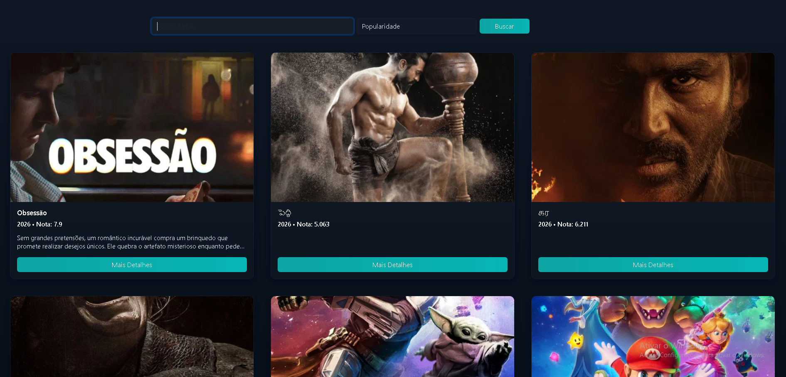
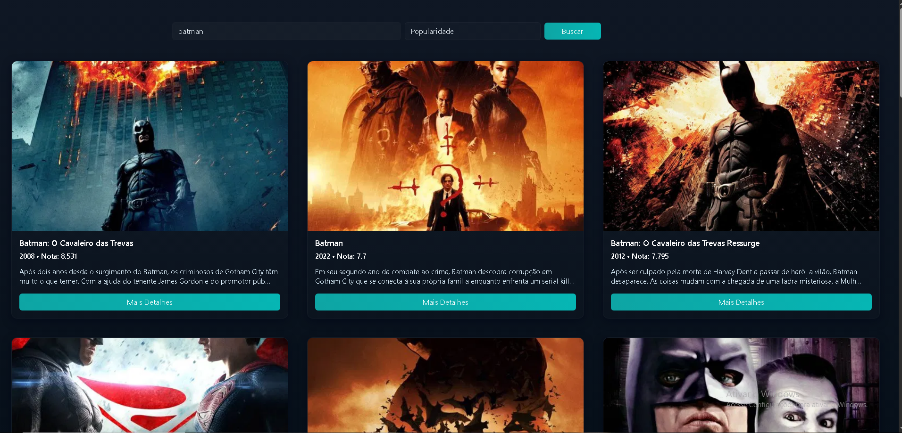

# Trabalho Prático - Semana 12

Nesta atividade, vamos trabalhar com uma API de mercado para montar uma interface de visualização de filmes. Para isso, vamos utilizar a [The Movie Database (TMDB) API](https://developer.themoviedb.org/docs/getting-started). A página resultante deve listar os resultados de uma requisição HTTP em formato de cards e deve incluir uma funcionalidade de pesquisa ou filtro. 

## Informações Gerais

- Nome: Diogo Vieira Teodoro Ferreira
- Matrícula: 1645894
- Endpoint escolihdo: Filmes Populares
- Descrição do fluxo: 
    Requisição: fetchMovies(query) faz fetch à API (endpoint de busca ou populares) e obtém JSON.
    Tratamento: o JSON é convertido em objetos, filtrado/ordenado (applySort) e armazenado em movies; showMessage atualiza o estado (carregando/erro/empty).
    Renderização: renderMovies limpa #movie-list, cria cards via createMovieCard (poster, título, ano, nota, sinopse curta) e anexa ao container.

## Prints do trabalho

<< LISTA DE CARDS COM FILMES >>

<< RESULTADO DE UMA PESQUISA >>

